Contents lists available at [ScienceDirect](https://www.elsevier.com/locate/knosys)

# Knowledge-Based Systems

journal homepage: [www.elsevier.com/locate/knosys](https://www.elsevier.com/locate/knosys)


# Knowledge guided deep deterministic policy gradient

Peng Qin , Tao Zhao [∗](#page-0-0)

*College of Electrical Engineering, Sichuan University, Chengdu 610065, China*

# A R T I C L E I N F O

*Keywords:* Knowledge guide Fuzzy system Mapless navigation DDPG

#### A B S T R A C T

Deep deterministic policy gradient (DDPG) exhibits excellent handling capabilities for complex regulation and control problems with continuous state and action spaces. However, its trial-and-error interaction and learning from scratch require extensive exploration by the agent, leading to low learning efficiency and even non-convergence in sparse reward environments. To fully utilize knowledge during the learning process to improve efficiency and performance, this paper draws inspiration from human learning methods and proposes a semantic knowledge-guided DDPG (KGDDPG) approach. In terms of knowledge representation, considering the fuzziness and precision of semantic knowledge, a knowledge system based on a rule framework combining precise propositions and fuzzy propositions is constructed. In terms of knowledge integration, to reduce the randomness of exploration, a knowledge-guided action strategy based on stacked generalization is proposed. Furthermore, a supervised-then-reinforced learning method is employed: the "supervised" phase quickly incorporates prior knowledge to accelerate learning, while the "reinforced" phase refines the policy network to overcome the limitations of relying solely on prior knowledge. Finally, experiments were conducted using a mapless navigation task for mobile robots to verify the effectiveness and practical feasibility of the method.

# **1. Introduction**

Navigation technology is a core aspect of mobile robots' autonomy and is crucial for achieving efficient and flexible operations. Traditionally, navigation relies on Simultaneous Localization and Mapping (SLAM) technology [[1](#page-15-0)[–3\]](#page-15-1), which enables robots to construct environmental maps in real time using sensor data (e.g., LiDAR, cameras, inertial measurement units) while simultaneously determining their positions within the map. However, SLAM methods face significant limitations in certain scenarios. For instance, in dynamic environments, rapid environmental changes may render previously built maps outdated, making map updates difficult and time-consuming. Furthermore, in privacy-sensitive or unstructured environments (e.g., private residences or military bases), relying on pre-built maps is impractical. As a result, mapless navigation has emerged as a crucial research direction for mobile robots.

Mapless navigation requires robots to rely solely on sensor inputs and internal algorithms to perceive their surroundings in real time and make decisions autonomously. This approach aligns with the characteristics of end-to-end models, which is why reinforcement learning (RL) has become increasingly popular for mapless navigation tasks [\[4–](#page-15-2) [6](#page-15-3)]. However, existing RL methods face two primary challenges: (1) Low learning efficiency: Most RL algorithms adopt a learning-fromscratch paradigm, requiring large amounts of data, which makes the learning process time-consuming. (2) Convergence difficulties: In dense or complex environments, the random interaction mechanism used in RL struggles to collect effective data, leading to slow convergence and suboptimal performance.

To address these issues, this study explores the integration of prior knowledge into reinforcement learning, aiming to enhance learning efficiency and accelerate policy optimization. However, developing a knowledge-guided RL framework involves the following challenges: (1) Knowledge representation: Existing methods struggle to represent both precise and fuzzy knowledge simultaneously, necessitating the design of a hybrid system that combines their advantages. (2) Knowledge integration: Efficiently embedding prior knowledge into RL frameworks such as DDPG to improve exploration remains an open problem. (3) Knowledge limitations: Prior knowledge is inherently uncertain and may contain inaccuracies, posing the risk of negatively affecting learning performance. Mitigating such risks while leveraging knowledge is a critical challenge.

This paper proposes a KGDDPG approach to address the above challenges, making the following contributions:

• (1) This paper draws inspiration from human learning patterns and extends the traditional DDPG framework. A knowledge system combining fuzzy propositions and precise propositions is

*E-mail addresses:* [qinpeng2@stu.scu.edu.cn](mailto:qinpeng2@stu.scu.edu.cn) (P. Qin), [zhaotaozhaogang@scu.edu.cn](mailto:zhaotaozhaogang@scu.edu.cn) (T. Zhao).

<span id="page-0-0"></span><sup>∗</sup> Corresponding author.

constructed, integrating the characteristics of fuzzy reasoning and binary logic, thereby improving the limitations of using each individually. This system is integrated into the existing DDPG framework, providing a new approach for knowledge-guided reinforcement learning.

- (2) To alleviate the issues of low learning efficiency caused by the trial-and-error mechanism and the convergence problems brought about by sparse rewards, a knowledge-guided action strategy based on stacked generalization is proposed. This strategy integrates the outputs of the knowledge system and the policy network. Compared to the noise-added random exploration method, it reduces the randomness of exploration, quickly obtains effective data, and thereby improving learning efficiency and enhancing convergence.
- (3) To fully utilize prior knowledge and mitigate the limitations of prior knowledge, a supervised-then-reinforced learning method is proposed. This method first uses the knowledge system as the target for supervised learning, enabling the policy network to fully leverage the knowledge to form a foundation. Subsequently, autonomous reinforcement learning is employed to overcome the limitations of the knowledge.

Based on the above work, this study integrates knowledge with DDPG. By leveraging knowledge guidance, the exploration-interaction process and the learning process are optimized, enhancing learning efficiency and convergence, thereby improving the model's overall performance. Compared to random exploration strategies, the proposed method incorporates knowledge-guided interaction strategies, imparting a certain degree of purposefulness to the interaction process. Furthermore, in contrast to using fuzzy systems or binary logic alone for knowledge representation, the proposed hybrid knowledge system combines the strengths of both approaches. Compared to general knowledge-guided methods, this approach not only utilizes knowledge effectively but also accounts for the limitations of knowledge, helping to avoid falling into local optima.

The remainder of this paper is organized as follows: Section [2](#page-1-0) introduces some related works. Section [3](#page-2-0) provides the construction details of KGDDPG. Experimental setup are conducted and in Section [4](#page-5-0). The results are analyzed in Section [5](#page-7-0). Finally, conclusions are drawn in Section [6](#page-14-0).

# **2. Related work**

### <span id="page-1-0"></span>*2.1. DDPG in control and navigation*

Deep reinforcement learning (DRL) has shown great potential in solving continuous control problems, where the state and action spaces are continuous. Among DRL algorithms, DDPG stands out due to its ability to handle complex control tasks by combining the strengths of Actor–Critic architecture, experience replay, target networks, and deterministic policy optimization. This design has enabled DDPG to achieve remarkable performance in fields such as robotic control [[7](#page-15-4), [8](#page-15-5)], navigation [\[9,](#page-15-6)[10\]](#page-15-7), and autonomous driving [\[11](#page-15-8)[,12](#page-15-9)]. For example, a DDPG controller combined with traditional PID control was proposed for trajectory tracking tasks in mobile robots, leveraging PID's stability to complement DDPG's adaptability [\[7\]](#page-15-4). In navigation applications, the high variance in DDPG's performance was addressed by a method that randomly switches between DDPG and PID control, balancing exploration and stability [\[9\]](#page-15-6). In the context of autonomous driving, a multi-challenge deep learning network was integrated into the DDPG framework to improve decision-making performance in complex driving environments [\[10](#page-15-7)]. Furthermore, a limited-horizon DDPG algorithm was proposed to enhance training efficiency by introducing stationary approximation and reducing the state space. However, DDPG also faces challenges, such as inefficient exploration caused by random noise-based strategies and high data requirements due to its learning-from-scratch approach. These limitations often lead to slow convergence, especially in sparse reward or complex environments. Recent studies have explored various improvements, such as combining DDPG with external knowledge and enhancing exploration strategies, to address these issues.

# *2.2. Knowledge representation and integration*

In knowledge-guided learning methods, the challenges of knowledge representation and knowledge integration are fundamental to ensuring effectiveness and adaptability. These challenges arise due to the inherent diversity of knowledge: knowledge can originate from various sources (e.g., human experience, sensor data, symbolic rules) and exist in different forms (e.g., structured graphs, unstructured demonstrations, or abstract semantics). Consequently, the representation method chosen for knowledge directly affects how it can be integrated into learning algorithms.

Knowledge representation methods in existing research include demonstration data [\[13](#page-15-10)], knowledge graphs [\[14](#page-15-11),[15\]](#page-15-12), and symbolic models [[16,](#page-15-13)[17](#page-15-14)]. Demonstration data, typically obtained from expert demonstrations, is a widely used method that directly encodes taskspecific expertise. For instance, [\[13](#page-15-10)] employed demonstration data to accelerate learning in robotics tasks, showing its potential to reduce exploration time. However, this method relies heavily on task-specific demonstrations, limiting its generalizability. Knowledge graphs, on the other hand, excel at encoding relationships between entities, making them particularly effective in reasoning tasks such as recommendation systems [[14\]](#page-15-11). For example, [\[15](#page-15-12)] proposed an enhanced graph-based approach for state augmentation, which improved decision-making efficiency in sparse-reward environments. Symbolic models provide an explicit way to represent environmental dynamics or task rules, as demonstrated in [[16\]](#page-15-13), where symbolic representations were used to guide exploration in RL. For tasks such as mobile robot navigation, which are closely tied to human daily activities, humans possess extensive experiential and semantic knowledge. This form of knowledge serves as a critical resource, offering broad coverage and originating from diverse scenarios. It can effectively guide robots in similar task environments and is relatively easy to obtain. However, the aforementioned knowledge representation methods are not well-suited for representing such experiential and semantic knowledge, limiting their applicability in these contexts. Since semantic knowledge is an abstract expression of knowledge, although humans can easily understand it, machines cannot. To represent this type of knowledge, scholars have proposed binary logic and fuzzy systems. Binary logic excels at precise reasoning, while fuzzy systems are good at approximate reasoning and are applied in various fields such as prediction [\[18](#page-15-15)[,19](#page-15-16)] and control [[20–](#page-15-17)[22\]](#page-15-18). Since semantic knowledge has both fuzziness and precision, combining binary logic with fuzzy systems is expected to better represent semantic knowledge.

The utilization of knowledge is closely related to its representation. For demonstration data, common methods of knowledge utilization include behavior cloning [\[23](#page-15-19)[,24](#page-15-20)] and inverse reinforcement learning [\[25](#page-15-21), [26\]](#page-15-22). Behavior cloning directly uses expert actions as label values for supervised learning, which can easily lead to the limitation of the model replicating the expert's strategy. The key to inverse reinforcement learning is to infer a reward function. Since multiple reward functions may correspond to the same behavior, this inference is uncertain. For knowledge graphs, common utilization methods include state augmentation or action candidates [\[14](#page-15-11)]. State augmentation involves transforming the state into a more instructive state and expanding the state dimensions. Action candidates are inferred through multi-hop reasoning in the knowledge graph to generate some candidate actions. For symbolic models, a common approach is to symbolically describe the environment and tasks, providing the agent with information to complete the tasks [\[16](#page-15-13)]. The above methods provide different application approaches based on knowledge representation methods and have achieved good results. However, they do not consider the limitations of knowledge. As mentioned in [\[17](#page-15-14)], human advice may lack sufficient knowledge, leading to uncertainty and incompleteness. Therefore, while utilizing knowledge, it is also necessary to consider its limitations. A single learning mode often cannot balance both aspects. Hence, how to fully utilize knowledge while reducing the impact of its limitations remains to be explored. This paper proposes a knowledge-guided DDPG framework to address these challenges. It integrates a semantic knowledge system that combines fuzzy and precise propositions to represent experiential knowledge. A stacked generalization-based action strategy reduces exploration randomness while maintaining task adaptability. By incorporating knowledge into parameter updates through a supervised-then-reinforced learning approach, the framework ensures efficient and robust learning.

#### **3. Knowledge guided deep deterministic policy gradient**

## <span id="page-2-0"></span>*3.1. Overall structure*

Semantic knowledge is a type of knowledge with abstract concepts. In existing research on knowledge utilization, semantic knowledge is typically represented by fuzzy systems. However, semantic knowledge encompasses both fuzziness and precision, making it difficult for general fuzzy systems to represent effectively. Therefore, this paper proposes a hybrid knowledge representation method that combines the representation capabilities of both fuzzy and precise knowledge. Additionally, integrating knowledge into the policy learning method is the most direct way to influence the reinforcement learning process. Since the DDPG method mainly includes action selection and value function learning, the proposed method primarily integrates knowledge directly into the policy learning process, focusing on knowledge-guided action exploration and knowledge-fused policy updates. The overall framework, as shown in [Fig.](#page-3-0) [1](#page-3-0), consists of three main components: the hybrid knowledge system, the knowledge-guided action strategy, and the policy update method. The framework operates in two main stages: interaction and parameter updates. In the interaction stage, state information (e.g., LiDAR point clouds, target position relative to the robot, and the previous action) is collected from the environment. This state is input to both the policy network, which generates action , and the knowledge system, which produces action . These actions are combined into a fused action through a generalization process and used to interact with the environment. The parameter update stage involves updating the policy network, the generalizer, and the value network. The policy network is updated first through supervised learning using outputs from the knowledge system, followed by reinforcement learning. The generalizer is updated by maximizing the value function of hybrid actions, and the value network is updated using the TD error of the fused actions. Detailed explanations of these processes are provided in later sections. Some of their characteristics are outlined as follows:

#### **Remark 1.** Feature 1: Fuzzy and Precise Knowledge Representation. Traditional binary logic has strong reasoning capabilities for handling precise knowledge but lacks the ability to process fuzzy knowledge. Conversely, fuzzy systems excel in fuzzy reasoning processes but are less effective in handling precise knowledge. In contrast, the knowledge representation method proposed in this paper integrates the characteristics of both approaches, enabling effective representation of both precise and fuzzy knowledge. This makes it applicable to a wider

#### **Remark 2.** Feature 2: Multi source action fusion interaction.

range of task scenarios and knowledge types.

Traditional noisy action exploration strategies exhibit high randomness, which may lead to a large number of invalid states during training. This not only results in low data collection efficiency but also poor data quality. In contrast, the knowledge-guided action strategy

<span id="page-2-1"></span>**Table 1** Proposition symbol.

| Symbol | Meaning                          |
|--------|----------------------------------|
| 𝑃𝑎     | Precise conditional propositions |
| 𝑄𝑎     | Precise conclusion propositions  |
| 𝑃𝑓     | Fuzzy conditional propositions   |
| 𝑄𝑓     | Fuzzy conclusion propositions    |

proposed in this paper integrates the outputs of the knowledge system with those of the action policy network. By leveraging the diversity of models, it effectively reduces abnormal outputs. This reduces the uncertainty of actions derived from a single model, alleviating issues of low data collection efficiency, poor data quality, and randomness in action selection, thereby improving training efficiency.

# **Remark 3.** Feature 3: Combining supervision and reinforcement.

The knowledge-guided parameter update method proposed in this paper includes a pre-supervised and then reinforcement learning approach for the policy network, and introduces hybrid actions into the subsequent state–action value calculation. The pre-supervised approach helps the agent quickly learn and establish a foundation, alleviating the slow convergence of the action value network, thereby accelerating the convergence of the policy network. Subsequently, the agent's autonomous interaction learning, independent of the knowledge system, can effectively avoid the limitations of the knowledge system. Additionally, since the update of the action value network depends on the action value of the subsequent state, and the policy network has high randomness in the early stages, it is not conducive to the update of the action value network. In contrast, introducing hybrid actions, which are superior to the policy network in the early stages, into the subsequent state–action value calculation is beneficial for the convergence of the action value network.

#### *3.2. Knowledge representation*

In knowledge-guided reinforcement learning, diverse knowledge sources range from systematic to empirical knowledge, including the semantic knowledge targeted in this paper, which possesses both precision and fuzziness. To effectively represent such knowledge, this paper proposes a hybrid representation method that incorporates precise and fuzzy propositions into a rule-based framework. The following will elaborate on the details of this representation method.

# *3.2.1. Condition and conclusion proposition*

Based on the precision and fuzziness of knowledge, propositions can be categorized into precise propositions and fuzzy propositions. Precise propositions have deterministic semantics, such as ''The sun is luminous'' or ''x = a''. In contrast, fuzzy propositions have indeterminate semantics, such as ''This person is elderly'' and ''The current speed is fast''. In these examples, the descriptions ''elderly'' for age or ''fast'' for speed carry fuzzy meanings. According to the above descriptions, the conditions and conclusion propositions can be defined as [Table](#page-2-1) [1](#page-2-1).

#### *3.2.2. Knowledge rules*

From the reasoning of the above condition and conclusion propositions, basic rules can be formulated. Considering that the condition and conclusion propositions may consist of multiple sub-propositions, and assuming that the sub-propositions are independent of each other, the condition and conclusion propositions are described in the form of sets, where represents the number of sub-propositions.

$$\begin{cases} P = \{P_1, P_2 \dots P_n\} \\ Q = \{Q_1, Q_2 \dots Q_n\} \end{cases}$$
 (1)

Additionally, based on the precision and fuzziness of propositions, knowledge rules can be categorized as follows:

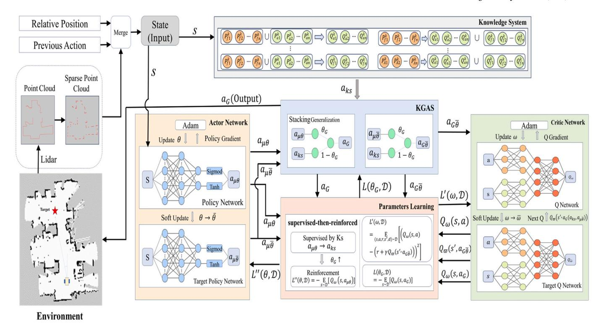

Fig. 1. The diagram of general structure of KGDDPG.

<span id="page-3-0"></span>1. Precise rules: That is, both the condition propositions and conclusion propositions are precise propositions, such as "When there is an obstacle in front of the robot, the robot stops" or "When x > a, y = b". This type of knowledge is represented as (2).

$$F_{a}^{k}:\{P_{a1}^{k}, P_{a2}^{k}...P_{an}^{k}\} \Rightarrow \{Q_{a1}^{k}, Q_{a2}^{k}...Q_{an}^{k}\}$$
 (2)

where  $F_a^k$  represents the kth precise rule,  $P_{ai}^k$  represents the ith precise sub-condition proposition of the kth rule, and  $Q_{ai}^k$  represents the ith precise sub-conclusion proposition of the kth precise rule.

2. Fuzzy rules: The condition propositions and conclusion propositions of fuzzy rules are both fuzzy propositions, such as "When the robot is far from the target, the robot's speed can increase" and "When the robot's speed is fast and the road ahead is narrow, the robot's speed needs to decrease". This type of knowledge is represented as (3).

$$F_f^k: \{P_{f1}^k, P_{f2}^k...P_{fn}^k\} \Rightarrow \{Q_{f1}^k, Q_{f2}^k...Q_{fn}^k\}$$
 (3)

where  $F_f^k$  represents the kth fuzzy rule,  $P_{fi}^k$  represents the ith fuzzy subcondition proposition of the kth rule, and  $Q_{fi}^k$  represents the ith fuzzy subconclusion proposition of the  $k_{th}$ fuzzy rule.

3. Hybrid rules encompass both fuzzy and precise propositions. Based on different hybridization methods, they can be categorized as follows:

Condition Hybridization: The condition propositions include both precise and fuzzy propositions. For example, "When the robot is to the left of an obstacle and close to it, the robot's direction deviates to the left" and "When the robot is to the left of an obstacle and close to it, the robot's direction deviates by a fixed angle to the left". This can be represented as (4).

$$F_{hp}^{k} : \begin{cases} \{P_{f1}^{k}, \dots, P_{fn}^{k}\} \cup \{P_{a1}^{k}, \dots, P_{an}^{k}\} \Rightarrow \{Q_{a1}^{k}, \dots, Q_{an}^{k}\} \\ \{P_{f1}^{k}, \dots, P_{fn}^{k}\} \cup \{P_{a1}^{k}, \dots, P_{an}^{k}\} \Rightarrow \{Q_{f1}^{k}, \dots, Q_{fn}^{k}\} \end{cases}$$

$$(4)$$

Conclusion Hybridization: The conclusion propositions include both precise and fuzzy propositions. For example, "When x = a,  $y_1$  is large,  $y_2 = c$ " and "When x is large,  $y_3$  is small,  $y_4 = d$ ". This can be

<span id="page-3-4"></span>represented as (5)

$$F_{hq}^{k} : \begin{cases} \{P_{f1}^{k}, \dots, P_{fn}^{k}\} \Rightarrow \{Q_{a1}^{k}, \dots, Q_{an}^{k}\} \cup \{Q_{f1}^{k}, \dots, Q_{fn}^{k}\} \\ \{P_{a1}^{k}, \dots, P_{an}^{k}\} \Rightarrow \{Q_{a1}^{k}, \dots, Q_{an}^{k}\} \cup \{Q_{f1}^{k}, \dots, Q_{fn}^{k}\} \end{cases}$$
(5)

<span id="page-3-1"></span>Condition and Conclusion Hybridization: Both the condition and conclusion propositions include precise and fuzzy propositions. For example, "When  $x_1 = a$  and  $x_1$  is large,  $y_1$  is large,  $y_2 = c$ ". This can be represented as (6).

<span id="page-3-5"></span>
$$F_h^k : \{ P_{f_1}^k, \dots, P_{f_n}^k \} \cup \{ P_{a_1}^k, \dots, P_{a_n}^k \}$$

$$\Rightarrow \{ Q_{a_1}^k, \dots, Q_{a_n}^k \} \cup \{ Q_{f_1}^k, \dots, Q_{f_n}^k \}.$$
(6)

#### 3.2.3. Knowledge inference

<span id="page-3-2"></span>For precise condition sub-propositions, due to their binary, their activation strength can be expressed as (7).

<span id="page-3-6"></span>
$$f(P_{ai}^{k}) = \begin{cases} 1 & if P_{ai}^{k} \text{ TRUE} \\ 0 & if P_{ai}^{k} \text{ FALSE} \end{cases}$$
 (7)

Thus, the activation strength of proposition  $P_a^k$  is (8).

<span id="page-3-7"></span>
$$f(P_a^k) = \prod_{i=0}^n f(P_{ai}^k) \tag{8}$$

For fuzzy condition propositions, due to their fuzziness, the calculation method of membership degree in fuzzy systems is adopted. The strength of sub-propositions can be expressed as (9).

<span id="page-3-8"></span>
$$f(P_{fi}^k) = \mu_A(x_i) \tag{9}$$

<span id="page-3-3"></span>where  $x_i$  is the subject variable in proposition  $P_{f_i}^k$ , and A is the corresponding fuzzy set. According to the above formula, the activation strength of proposition  $P_f^k$  is (10).

<span id="page-3-9"></span>
$$f(P_f^k) = \prod_{i=0}^n f(P_{fi}^k) \tag{10}$$

Based on the above analysis, the inference results of precise rules, fuzzy rules, and hybrid rules are as (11).

$$\begin{cases} F_a^k y = f\left(P_a^k\right) * Q_a^k = \left\{F_a^k y_{num}\right\} \cup \left\{F_a^k y_c\right\}, \\ F_f^k y = f\left(P_f^k\right) * Q_f^k = \left\{F_f^k y_{num}\right\} \cup \left\{F_f^k y_c\right\}, \\ F_h^k y = f\left(P_a^k\right) * f\left(P_f^k\right) * \left[Q_a^k \cup Q_f^k\right] \\ = \left\{F_h^k y_{num}\right\} \cup \left\{F_h^k y_c\right\}. \end{cases}$$

$$(11)$$

where  $F_{a^k} y_{num}$ ,  $F_{f^k} y_{num}$ , and  $F_{h^k} y_{num}$  represent the numerical parts of the inference results for the three types of rules, which can be subjected to mathematical operations.  $(F_{a^k} y_c)$ ,  $(F_{f^k} y_c)$ , and  $(F_{h^k} y_c)$  represent the conditional parts of the inference results for the three types of rules, which cannot be subjected to numerical operations and can only serve as filtering conditions for the numerical results.

In summary, for a knowledge system encompassing multiple rules of the aforementioned different types, it can be represented as (12).

$$ks: \{F_a^1, F_a^2 \dots F_a^n\} \cup \{F_f^1, F_f^2 \dots F_f^j\} \cup \{F_h^1, F_h^2 \dots F_h^l\}$$
 (12)

where i, j, l represent the number of rules of the three different types, respectively. According to (11), the output of the propositions of the knowledge system can be obtained as (13).

$$ksy = \sum_{k=1}^{n} F_{a}^{k} y_{num} + \sum_{k=1}^{J} F_{f}^{k} y_{num} + \sum_{k=1}^{I} F_{h}^{k} y_{num}$$

$$s.t. \bigcup_{k=1}^{n} F_{a}^{k} y_{c} \bigcup_{k=1}^{J} F_{f}^{k} y_{c} \bigcup_{k=1}^{I} F_{h}^{k} y_{c}$$
(13)

The construction of the above knowledge system requires transforming knowledge into the form of IF-THEN rules and appropriately setting it within the scope of the task domain. For example, "when there is an obstacle on the left side of the mobile robot, it will move to the right" can be translated as if x < 0.3, then w > 0, where x represents the state and w represents the action. x < 0.3 is a precise conditional proposition, w > 0 is a precise conclusive proposition, and 0.3 is determined based on the domain of the actual task.

#### 3.3. Knowledge utilization

Similar to other reinforcement learning methods, the core of the KGDDPG algorithm still includes two parts: exploration and exploitation. The methods of exploration and exploitation significantly influence the learning process and the final policy. Therefore, how to integrate prior knowledge into both exploration and learning is key to constructing KGDDPG. The following will explain how to combine the knowledge system constructed in the previous section with DDPG to achieve the embedding and utilization of knowledge.

#### 3.3.1. Knowledge guided action strategy

Since DDPG is trained in an off-policy manner to obtain a deterministic policy, the actions obtained for a deterministic policy are deterministic each time. Therefore, it is impossible to obtain sufficiently broad and useful action information. The earliest solution was to add some Ornstein–Uhlenbeck (OU) noise to the actions [27] . The mathematical expression of the OU process is as (14).

$$dx_t = b(m - x_t)dt + vdW (14)$$

where  $x_t$  is the current process value, b is a positive number, m is the long-term mean, v is the standard deviation of the noise, and  $dW_t$  is a random differential term following a standard normal distribution. In practice, it is simulated by discrete time steps, where  $\xi_t$  is a random number.

$$x_{t+1} = x_t + b(m - x_t)\Delta t + v\sqrt{\Delta t}\xi_t \tag{15}$$

Although the above methods are easy to implement, the exploration process is random. In some cases, this may lead to reduced efficiency,

<span id="page-4-0"></span>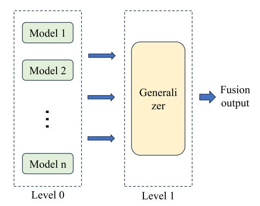

Fig. 2. Stacked generalization

<span id="page-4-4"></span><span id="page-4-1"></span>as the agent may spend a lot of time exploring irrelevant or low-reward states and actions. Additionally, this approach lacks guidance and does not direct the exploration process based on experience or environmental characteristics, making it difficult for the agent to effectively find the optimal policy. To address this issue, this paper proposes knowledge-guided action exploration.

<span id="page-4-2"></span>Through the previously constructed knowledge system, we have obtained a mapping between key states and actions, from which corresponding actions can be inferred. Essentially, this results in a strategy based on prior knowledge. Compared to a randomly initialized policy network, this strategy is more guiding within a certain scope. Therefore, combining the two approaches can reduce the randomness of action generation, making the interaction process more guided. The key challenge, however, is how to effectively fuse these two elements. In this paper, we employ stacked generalization to achieve this fusion. Stacked generalization is a widely used and effective method in the field of model ensemble [28,29]. It combines the outputs of various base models through weighted averaging, thereby enhancing the accuracy of the final results. Typically, it consists of two layers: the first layer contains the base models, and the second layer is the generalization layer, as shown in Fig. 2.

The knowledge system, the action policy network and the target action policy network in this paper can be regarded as distinct models. They yield actions  $a_{ks}$ ,  $a_{\mu\theta}$  and  $a_{\mu\bar{\theta}}$ , respectively. These actions are then input into the generalizer to obtain the fused action as (16).

<span id="page-4-5"></span>
$$\begin{cases} a_G = G(a_{ks}, a_{\mu}\theta) \\ a_{G\bar{\theta}} = G(a_{ks}, a_{\mu}\bar{\theta}) \end{cases}$$
 (16)

where, G is a generalization layer function, usually constructed by neural networks. The structure and parameters of the network vary with the number of basic models, and its parameters are obtained through training.

Since there are only two models, the fused action can be simplified as (17), with the parameter  $\theta_G$  initialized empirically based on the level of trust in the knowledge.

<span id="page-4-6"></span><span id="page-4-3"></span>
$$\begin{cases} a_{G} = a_{G}(a_{ks}, a_{\mu\theta}) = \theta_{G} a_{\mu\theta} + (1 - \theta_{G}) a_{ks} \\ a_{G\bar{\theta}} = a_{G}(a_{ks}, a_{\mu\bar{\theta}}) = \theta_{G} a_{\mu\bar{\theta}} + (1 - \theta_{G}) a_{ks} \end{cases}$$
(17)

The parameter  $\theta_G$  needs to continuously change with the learning of the policy network  $\mu(s|\theta)$  to increase the proportion of  $\mu(s|\theta)$  in the output. The goal of the mixed action policy is to establish a better policy compared to the initial  $\mu(s|\theta)$  and the knowledge system. The parameter  $\theta_G$  can also be updated by maximizing the action value function  $Q_\omega(s,a)$ . The optimization objective is (18). Where  $\mathcal D$  is the sample dataset and s is the state.

<span id="page-4-7"></span>
$$L(\theta_G, D) = -\mathbb{E}[Q_{\omega}(s, a_G)]$$
 (18)

According to (13), the output of the knowledge system consists of two parts, a numerical value and a condition. To facilitate computation, in cases where the final result only includes the numerical part, the numerical values are padded according to the output dimensions and directly fused with the output of the policy network. The action used for interacting with the environment is (19).

$$a_t = \theta_G a_{\mu\theta} + (1 - \theta_G) a_{ks} + x_t + b(m - x_t) \Delta t + v \sqrt{\Delta t} \xi_t \tag{19} \label{eq:19}$$

3.3.2. Parameter updates in integrating supervised and reinforcement learning

DDPG learns both the action-value function  $Q_{\omega}(s,a)$  and the action policy  $\mu(s|\theta)$ . The  $Q_{\omega}(s,a)$  is updated by minimizing the Mean Squared Bellman Error (MSBE) as shown in (20).

$$L'(\omega, D) = \underset{S \sim D}{\mathbb{E}} \left[ Q_{\omega}(s, a) - (r + \gamma \max_{a'} Q_{\varpi}(s', a')) \right]^{2}$$
 (20)

where S is the sampled data tuple,  $\varpi$  represents the parameters of the target network, and  $\omega$  represents the parameters of  $Q_{\omega}(s,a)$ . The target network is softly updated using the Polyak averaging method, as (21)

$$\varpi \leftarrow \rho \varpi + (1 - \rho)\omega$$
 (21)

For the DDPG method, due to the deterministic nature of the action policy, the target action in (20) is not determined by the maximum  $Q_{\varpi}(s',a')$  value, but directly derived from  $\mu(s'|\bar{\theta})$ . Therefore, the objective function is rewritten as (22).

$$L'(\omega, D) = \underset{S \sim D}{\mathbb{E}} \left[ Q_{\omega}(s, a) - (r + \gamma Q_{\varpi}(s', \mu(s'|\bar{\theta}))) \right]^2$$
 (22)

In the aforementioned method,  $Q_{\varpi}(s',\mu(s'|\bar{\theta}))$  depends on a single network, which introduces uncertainty. The performance is significantly influenced by the single network, potentially affecting the convergence speed of the training process and even leading to instability. The previous work utilized a hybrid action selection strategy constructed with a knowledge system and policy network  $\mu(s|\theta)$  to interact with the environment. This hybrid action strategy can be directly used as an estimate for  $\max_{a'} Q_{\varpi}(s',a')$ , replacing the original  $Q_{\varpi}(s',\mu(s'|\bar{\theta}))$ . This approach leverages the diversity of different models, reducing the uncertainty of a single network and improving the training process. Consequently, the final loss function is (23).

$$L'(\omega, D) = \underset{S \sim D}{\mathbb{E}} \left[ Q_{\omega}(s, a) - (r + \gamma Q_{\varpi}(s', a_{G\bar{\theta}})) \right]^2$$
 (23)

Policy learning is conducted under the guidance of  $Q_{\omega}(s,a)$ . Assuming  $Q_{\omega}(s,a)$  is differentiable with respect to each action, it can be optimized through gradient ascent. The optimization objective is (24).

$$L''(\theta, D) = - \underset{s \sim D}{\mathbb{E}} \left[ Q_{\omega}(s, \mu(s|\theta)) \right]$$
 (24)

with the gradient given by (25).

$$\nabla_{\theta} L'' \approx -\frac{1}{N} \sum_{i=1}^{N} \nabla_{\theta} \mu(s_i | \theta) \nabla_{a} Q_{\omega}(s_i, a)|_{a = \mu(s_i | \theta)}$$
 (25)

In the aforementioned method, parameter updates are conducted solely under the guidance of  $Q_{\omega}(s,a)$ . Considering the presence of the knowledge system,  $Q_{\omega}(s,a)$  can be combined with the guidance provided by the knowledge system. Specifically, we aim for the policy network to quickly learn the behavior of the knowledge-based policy through supervised learning, with its loss function defined as (26).

$$L_s''(\theta, D) = \mathop{\mathbb{E}}_{s \sim D} [\mu(s|\theta) - a_G(a_{ks}, a_{\mu\theta})]^2$$
 (26)

As learning progresses, and taking into account the limitations of the knowledge-based policy, the policy network is further trained based on reinforcement learning. In this stage, the loss function is defined as (24).

These two learning approaches are integrated, with adjustments and transitions managed through the parameters of a hybrid policy. The final optimization objective is given by (27).

<span id="page-5-9"></span>
$$L''(\theta, D) = \underset{s \sim D}{\mathbb{E}} \left[ -\theta_G Q_{\omega}(s, \mu(s|\theta)) + (1 - \theta_G + \theta_T) \left[ \mu(s|\theta) - a_G(a_{ks}, a_{\mu\theta}) \right]^2 \right]$$

$$(27)$$

<span id="page-5-1"></span>Here,  $\theta_T$  is a fixed parameter, and its value depends on the level of trust in the knowledge system. If it is not zero, it indicates that even when  $\theta_G=1$ , there is always a certain proportion of supervised components in the policy network updates. For highly reliable knowledge systems, it is appropriate to retain a certain proportion of supervision. The supervised learning component of the loss function ensures that the policy network learns a reliable action strategy guided by the knowledge system, reducing exploration randomness and improving learning stability. The reinforcement learning component allows the policy network to explore and adapt to the environment dynamics further. By combining these two components, the policy network is able to leverage both the knowledge system's expertise and the environment's feedback, leading to a more robust and effective policy.

#### <span id="page-5-3"></span><span id="page-5-2"></span>3.4. KGDDPG algorithm

In summary, the overall algorithm flow of KGDDPG is shown in the Algorithm 1.

# <span id="page-5-4"></span>Algorithm 1 Knowledge Guide Deep Deterministic Policy Gradient

```
Given: Policy network \mu(s|\theta) with parameters \theta, Q_{\omega}(s,a) parameters
\omega, a_G(a_{ks}, a_{\mu}) parameters \theta_G, empty replay buffer \mathcal{D}
Set target parameters equal to main parameters: \bar{\theta} \leftarrow \theta, \varpi \leftarrow \omega
for episode = 1, 2, ..., M do
   Observe initial state s
   for t = 1, 2, ..., T do
       select action a_t = \theta_G a_{\mu\theta} + (1 - \theta_G) a_{ks} + x_t + b(m - x_t) \Delta t + v \sqrt{\Delta t \xi_t}
       Execute action a_t and observe reward r_t and new state s_{t+1}
       Store transition (s_t, a_t, r_t, s_{t+1}) in \mathcal{D}
       if s_{t+1} is terminal then
          Reset environment state
       end if
      if time to update then
          Sample a batch of transitions (s_i, a_i, r_i, s'_i) from \mathcal{D}
          Update Q_{\omega}(s,a) based on L'(\omega,\mathcal{D}) (Eq. (23)).
          Update \mu(s|\theta) based on L''(\theta, \mathcal{D}) (Eq. (27)).
          Update a_G(a_{ks}, a_{\mu\theta}) based on L(\theta_G, \mathcal{D}) (Eq. neqrefeq3.3.8). Update target network with \varpi \leftarrow \rho \varpi + (1-\rho)\omega, \theta \leftarrow \rho \bar{\theta} + (1-\rho)\theta
       end if
   end for
end for
```

# <span id="page-5-7"></span><span id="page-5-6"></span><span id="page-5-5"></span>4. Simulation and experimental setup

<span id="page-5-8"></span><span id="page-5-0"></span>This paper aims to utilize hybrid knowledge to guide the learning process of DDPG, thereby improving learning efficiency and overall performance. To verify the effectiveness and feasibility of the proposed method, simulation and real-world experiments were conducted using mapless mobile robot navigation as the validation task. The simulations were based on the Gazebo platform, and the experiments were conducted on the TurtleBot3 mobile robot platform. Three different test environments were constructed for both platforms, varying in complexity and size to ensure diversity. This section will describe the environments, MDP formulation, knowledge system, and implementation details.

<span id="page-6-1"></span>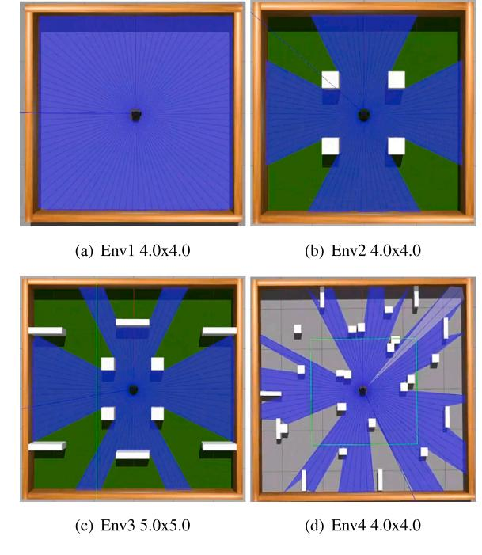

Fig. 3. Simulation environment.

#### <span id="page-6-0"></span>4.1. Environment

#### 4.1.1. Training environment

The training environments are shown in Fig. 3. Fig. 3(a) depicts an open environment without obstacles, requiring the mobile robot to quickly reach a designated area. Fig. 3(b) introduces several square obstacles placed densely, requiring the mobile robot to navigate through narrow spaces with multiple obstacles. Fig. 3(c) presents a more complex but wider environment compared to the previous scenarios, requiring the mobile robot to navigate in a complex environment. Fig. 3(d) presents an even more challenging scenario with a significantly higher number of densely distributed obstacles, simulating a high-density obstacle field. This environment requires the robot to make precise decisions while avoiding obstacles in tight spaces. The diversity of environments allows the proposed method to be validated from different perspectives.

# 4.1.2. Experimental environment

The experimental environments are shown in Fig. 4. Fig. 4(a) and (b) replicate the simulation environments (a) and (b), respectively, to directly validate the performance of the trained model when deployed on an actual robot. Fig. 4(c) represents a more open experimental environment, testing the model's continuous navigation capability in an open space, thereby validating the model's generalization ability. Fig. 3(d) features a dense obstacle environment, verifying navigation capability in narrow environments

#### 4.2. MDP formulation

In this paper, the navigation problem is modeled as a MDP with the following components:

State Space: The state input is designed to capture the agent's perception of the environment, the relative position of the target, and its historical actions. It includes the following:

(1) LiDAR Point Cloud Data: The robot perceives its surroundings through LiDAR sensors, with the point cloud sampled every 4 degrees, resulting in 90 dimensions. This provides the agent with a detailed view

<span id="page-6-5"></span>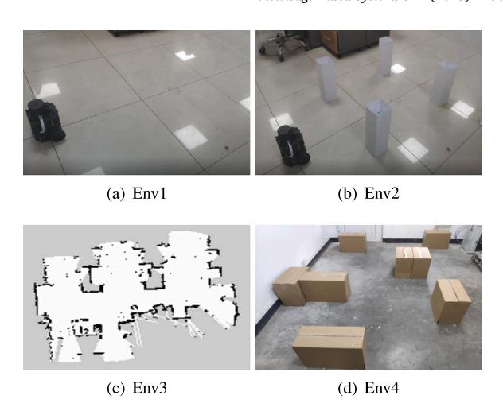

Fig. 4. Experimental environment.

<span id="page-6-6"></span><span id="page-6-4"></span><span id="page-6-3"></span>Table 2 Knowledge rule for Env1.

<span id="page-6-2"></span>

| Num | Knowledge                                                                                                |
|-----|----------------------------------------------------------------------------------------------------------|
| 0   | If the target is on the left, turn left (fuzzy knowledge)                                                |
| 1   | If the target is on the right, turn right (fuzzy knowledge)                                              |
| 2   | If there is an obstacle less than 0.3 m in the forward direction, stop                                   |
|     | (precise knowledge)                                                                                      |
| 3   | If the vehicle is facing the target and there are no obstacles ahead,<br>move forward (hybrid knowledge) |

of nearby obstacles and free space.

- (2) Relative Target Position: Deviation angle and distance between robot and target point
- (3) Previous Action: The agent's action from the last step (angular and linear velocity) is included to help the policy learn temporal dependencies, adding 2 dimensions. This results in a total of 94 dimensions in the state space.

Action Space: The action output includes angular velocity and linear velocity. The angular velocity range is constrained to (-1.0, 1.0) using the tanh function. The forward linear velocity range is constrained to (0, 0.5) using the sigmoid function.

Reward Function: The reward function is designed to encourage the robot to efficiently and safely navigate toward the target while avoiding collisions. It consists of four components:

$$\begin{cases} r_{reach}if d_t < RTH \\ r_{collision}if \min_{x_i} < CTH \\ (d_{t-1} - d_t)p_r \end{cases}$$

$$(28)$$

where  $d_t$  is the distance to the target point,  $\min_{x_i}$  is the minimum value of the LiDAR point cloud,  $p_r$  is a proportional parameter, and  $r_o$  is the reward for each step taken. RTH and CTH are the reaching threshold and collision threshold, respectively. The reward design aims to balance safety and goal-reaching efficiency. A large positive reward  $r_{reach}$  incentivizes the agent to reach the target. A significant negative reward  $r_{collision}$  discourages unsafe behavior near obstacles. A proportional reward encourages the agent to reduce the distance to the target in each step. A small penalty  $r_o$  prevents the agent from taking unnecessary steps or stagnating.

#### 4.3. Knowledge system for train

We have constructed corresponding knowledge rules based on different scenarios, as shown in the Tables 2 and 3.

<span id="page-7-1"></span>**Table 3** Knowledge rule for Env2 and Env3.

| Num | Knowledge                                                               |
|-----|-------------------------------------------------------------------------|
| 0   | If the target is on the left, turn left (fuzzy knowledge)               |
| 1   | If the target is on the right, turn right (fuzzy knowledge)             |
| 2   | If there is an obstacle less than 0.3 m in the forward direction, stop  |
|     | (precise knowledge)                                                     |
| 3   | If the vehicle is facing the target and there are no obstacles ahead,   |
|     | move forward (hybrid knowledge)                                         |
| 4   | If the vehicle is close to an obstacle on the left, shift to the right. |
|     | (fuzzy knowledge)                                                       |
| 5   | If the vehicle is close to an obstacle on the right, shift to the left. |
|     | (fuzzy knowledge)                                                       |
| 6   | If there is an obstacle in front of the vehicle and the target is on    |
|     | the left, turn left,if the target is on the right, turn right (hybrid   |
|     | knowledge)                                                              |
|     |                                                                         |

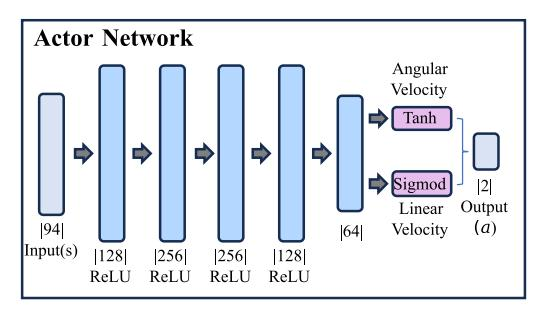

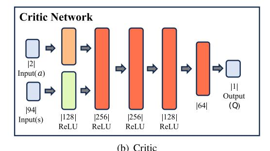

**Fig. 5.** Actor-Critic Network.

<span id="page-7-2"></span>**Remark 4.** The knowledge in Env2 and Env3 inherits part of the knowledge from Env1. Despite changes in the environment, this portion of knowledge remains applicable, highlighting a significant difference from purely data-driven knowledge. This demonstrates the abstract expression capability of semantic knowledge.

#### *4.4. Implementation details*

#### *4.4.1. Training details*

The network structure is shown in [Fig.](#page-7-2) [5.](#page-7-2) The input to the actor network is 94-dimensional, followed by 5 fully connected layers with ReLU activation, and the output is 2-dimensional. The speed is constrained to the range [0,1] using the sigmoid function, and the acceleration is constrained to the range [−1,1] using the hyperbolic tangent function.

The critic network is used to predict the value of actions, with inputs of 94-dimensional state and 2-dimensional action. These inputs are merged after a single dense layer and then passed through 4 fully connected layers with ReLU activation.

All networks are trained using the Adam optimizer in PyTorch on an NVIDIA RTX 3060 GPU. The hyperparameters used in this paper are listed in [Table](#page-7-3) [4.](#page-7-3)

<span id="page-7-3"></span>**Table 4** Parameter setting.

| Items           | Value                               |
|-----------------|-------------------------------------|
| min_buffer_size | 1500                                |
| optimizer       | Adam lr:0.0001                      |
| 𝛾               | 0.99                                |
| 𝜏               | 0.05                                |
| 𝐸𝑃              | 600(Env1) 6000(Env2, Env3 and Env4) |
| Buffer_size     | 100 000                             |
| batch_size      | 256                                 |
| max_steps       | 200(Env1) 350(Env2, Env3 and Env4)  |
| 𝜃𝐺              | 0.1                                 |
| 𝜃𝑇              | 0.5(Env1, Env4) 0(Env2, Env3)       |

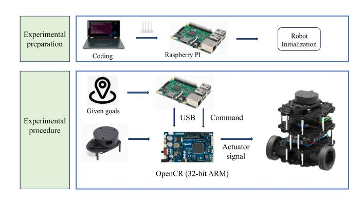

**Fig. 6.** Experimental process.

#### <span id="page-7-4"></span>*4.4.2. Experimental details*

To validate the effectiveness of the proposed method in a real system, relevant experiments were conducted. The experimental platform and experimental process are shown in [Fig.](#page-7-4) [6.](#page-7-4) The main hardware components of the TURTLEBOT include two XL430 drive motors, a control board OpenCR, a Raspberry Pi, a battery, an IMU, and an rpA1 LiDAR sensor. The maximum speed is 0.22 m/s, and the maximum angular velocity is 2.84 rad/s. The trained model is directly deployed onto the robot, which receives and samples data from the LiDAR, publishes the target point, autonomously calculates the angular and linear velocities, and records the robot's trajectory, number of arrivals, and number of collisions.

#### *4.4.3. Baseline*

- 1. **DDPG:** DDPG uses an actor-critic framework for continuous action spaces, with deterministic policies and target networks for stability.
- 2. **TD3:** TD3 improves DDPG by addressing Q-value overestimation using two critics, delayed updates, and action noise smoothing.
- 3. **PKDDPG** [[30\]](#page-15-26): PKDDPG incorporates a fuzzy controller to probabilistically guide interaction, leveraging external knowledge to improve performance.
- 4. **RSSAC** [\[31](#page-15-27)]: RSSAC enhances SAC by incorporating reward shaping to improve learning efficiency and task performance.

### **5. Results and discussion**

<span id="page-7-0"></span>To specifically compare the results of different methods, the following metrics were adopted.

- (1) Learning Efficiency: Measured by the number of episodes required to reach the threshold of task success rate.
- (2) Success Rate: The ratio of the robot reaching the target without collision within the timeout threshold.
- (3) Path Efficiency: The ratio of the actual path length traveled by the robot to the total shortest path length from the starting position to each target point.

<span id="page-8-0"></span>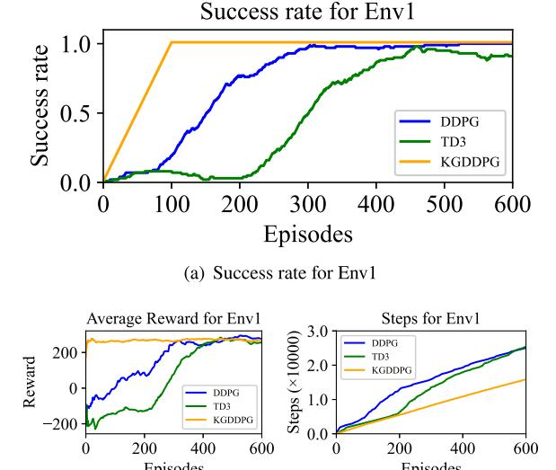

**Fig. 7.** Train for Env1.

Due to the randomness of target points during the training process and the large training volume, it is inefficient to calculate path efficiency. Therefore, path efficiency is only calculated during the experiments.

# *5.1. Training results*

#### *5.1.1. Env1*

The environment is an open space without obstacles, which is advantageous for random exploration and facilitates the convergence of the agent. [Fig.](#page-8-0) [7\(a\)](#page-8-0) illustrates the relationship between task success rate and the number of episodes. It can be observed that the proposed method quickly reaches 100%, demonstrating higher learning efficiency compared to other methods. This is because the prior knowledge fully meets the task requirements, enabling the policy network to rapidly acquire the knowledge with the help of supervised learning. Additionally, the lower success rate of TD3 compared to DDPG in the early stages is due to its inherent delayed update strategy, which leads to slower policy updates, resulting in a large number of collision terminations. This hinders effective exploration and prevents the rapid acquisition of effective data.

[Fig.](#page-8-1) [7\(b\)](#page-8-1) shows the average reward curve. The curve of the proposed method starts with a high reward because the prior knowledge is suitable for the task requirements. Under the supervision, the policy network learns the prior knowledge and gradually increases its proportion of interactive actions until it smoothly transitions to autonomous exploration. This demonstrates the positive effect of the supervised learning component on the agent's learning process. It indicates that, given the completeness and adaptability of the knowledge, the proposed method can achieve stable learning.

[Fig.](#page-8-1) [7\(c\)](#page-8-1) illustrates the variation in training steps. The interaction steps corresponding to the proposed method increase steadily with the number of episodes, indicating that the agent does not engage in extensive random exploration for different task points. Instead, it performs guided exploration under the influence of the knowledge system, resulting in relatively stable policy network outputs. In contrast, the interaction steps of DDPG rise rapidly in the early stages, suggesting that the agent conducted extensive random exploration under the randomized exploration strategy. TD3, on the other hand, shows a delayed increase in interaction steps compared to DDPG, which is due to TD3's inherent delayed update strategy affecting the early exploration process and data collection.

<span id="page-8-2"></span>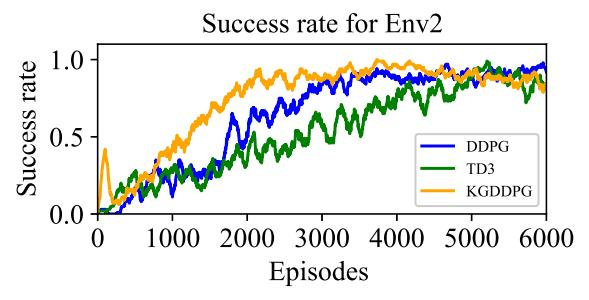

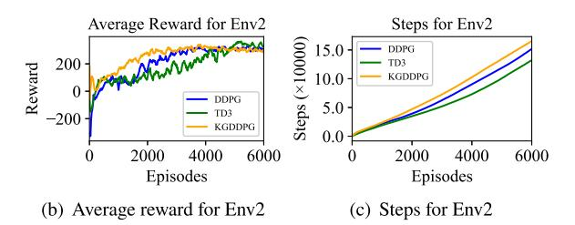

<span id="page-8-3"></span>**Fig. 8.** Train for Env2.

<span id="page-8-1"></span>In summary, the proposed method effectively maximizes the role of supervised learning under the condition of complete knowledge, allowing the learning process to transition smoothly. Guided exploration under the knowledge system can effectively overcome the drawbacks of random exploration strategies, significantly reducing the number of exploration steps and enabling the rapid collection of high-quality data, thereby improving learning efficiency.

# *5.1.2. Env2*

In this environment, obstacles are added near the robot's starting point, forming a surrounding space. Compared to Env1, this environment better tests the effectiveness of various methods. The analysis is similarly based on task success rate, average reward curve, and interaction steps.

[Fig.](#page-8-2) [8\(a\)](#page-8-2) shows the task success rate curve with a sliding window of 100. The success rate of KGDDPG peaks before 300 episodes, with a significant increase before 150 episodes, followed by a decline between 150 and 300 episodes. This phenomenon is a result of the interaction between the knowledge system's outputs and the environment. In the early stages, the dominance of the knowledge system's outputs leads to an increase in success rate before 150 episodes. However, due to the incompleteness of the prior knowledge, which is only applicable to a limited number of scenarios in this environment, and the reduced proportion of knowledge system outputs, the existing action policy becomes insufficient to ensure task success, resulting in the decline in success rate between 150 and 300 episodes. The subsequent steady increase in task success rate indicates that the policy network begins to interact independently with the environment and learns efficiently. Compared to DDPG and TD3, the proposed method shows a steady rise in success rate during the later stages, which can be attributed to the foundational policy formed during supervised learning. The results confirm that the proposed method can leverage the foundational role of prior knowledge while avoiding the limitations imposed by the knowledge's constraints, thereby positively impacting the agent's learning process.

The average reward curve in [Fig.](#page-8-3) [8\(b\)](#page-8-3) follows a similar trend to the task success rate, further corroborating the previous conclusions. It can also be observed that the reward values of DDPG and TD3 are very low before 300 episodes, which is attributed to the robot moving away from the target during random exploration.

The number of steps for training shown in [Fig.](#page-8-3) [8\(c\)](#page-8-3) differs from in ENV1. Compared with DDPG and TD3, the proposed method has

<span id="page-9-0"></span>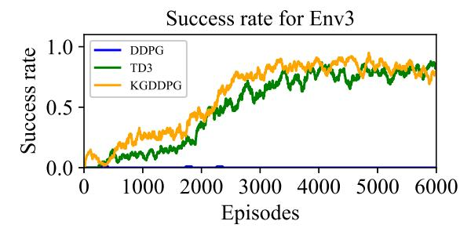

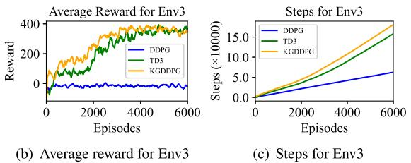

**Fig. 9.** Train for Env3.

more interaction steps. By combining the task success rate and average reward curve, it can be inferred that this is due to the robot completes more tasks in the range of 1000 to 3000 episodes, resulting in a higher number of corresponding interaction steps.

In summary, the results in Env2 further corroborate the conclusions drawn from the test results in Env1. This further demonstrates the effectiveness of the proposed method in utilizing knowledge and overcoming the limitations of knowledge, as well as its role in improving learning efficiency.

# *5.1.3. Env3*

This environment increases the difficulty compared to Env2 to further test the effectiveness of the method. Due to the complexity of the environment and the density of obstacles, the robot can easily get trapped in local environments during interactions, making it more challenging for the model to converge.

The task success rate curve of KGDDPG in [Fig.](#page-9-0) [9\(a\)](#page-9-0) shows a small slight before 300 episodes, similar to the peak observed in Env2. However, the peak is smaller because, in a more complex environment, the scenarios where the knowledge system is applicable are further reduced, highlighting the limitations of the knowledge. Subsequently, the policy network learns through autonomous interactions based on the foundation formed by supervised learning. Compared to TD3, the improvement in the success rate curve is not significant due to the substantial limitations of the knowledge system, which does not provide much useful information to the policy network. However, it still offers some assistance. The success rate of DDPG is almost zero because DDPG frequently collides in dense environments, resulting in fewer and lower-quality data, which prevents it from converging.

The average reward curve in [Fig.](#page-9-1) [9\(b\)](#page-9-1) is similar to the task success rate curve. Notably, the reward curve for DDPG shows that the robot mostly receives negative rewards, explaining why its model does not converge: random exploration fails to obtain effective data, preventing the policy network from being effectively updated. This results in poor interaction actions, creating a cycle that ultimately leads to model nonconvergence. The partial effectiveness of external knowledge also helps break this cycle, enhancing the ability to converge.

The training steps shown in [Fig.](#page-9-1) [9\(c\)](#page-9-1) indicate that the proposed method involves the highest number of interaction steps, similar to the reasons for interaction steps in Env2. Specifically, DDPG has the fewest steps due to frequent collisions with the environment, resulting in fewer interaction steps.

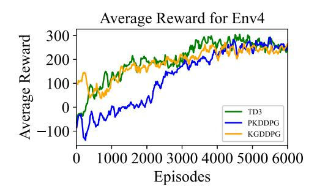

**Fig. 10.** Average reward for Env4.

<span id="page-9-3"></span><span id="page-9-2"></span>**Table 5** Runtime and success count for Env4.

|               | TD3    | PKDDPG | RSSAC  | KGDDPG |
|---------------|--------|--------|--------|--------|
| Runtime (s)   | 11 288 | 17 441 | 30 118 | 10 194 |
| Success Count | 3037   | 2569   | 2065   | 3344   |

<span id="page-9-1"></span>In summary, the training results across all environments indicate that the improvement in the learning process by the proposed method is influenced by the completeness of the knowledge. The more complete the knowledge, the greater the guiding effect of the knowledge. Even with incomplete knowledge, the proposed method can still effectively utilize the knowledge and overcome its limitations. This confirms that the proposed method's guided interactions using knowledge enhance learning efficiency and improve model convergence.

# *5.1.4. Env4*

This environment is more complex, with denser and more numerous obstacles, challenging the robot to navigate narrow passages. It simulates real-world conditions to evaluate the algorithm's adaptability and robustness. Metrics such as average reward, success rate, total successes, and runtime were recorded for comparison.

[Fig.](#page-9-2) [10](#page-9-2) presents the average reward curves. Since the RSSAC method uses reward shaping inconsistent with the rewards in this paper, it is excluded from the comparison. The yellow curve shows an initial peak, which, based on observations, results from early interaction guided by knowledge, leading to some successful episodes and higher rewards. The subsequent dip reflects the limitations of the knowledge and the increasing influence of autonomous interaction, which temporarily reduces performance. Between 600 and 2000 episodes, TD3's average reward is generally higher than KGDDPG's. However, this does not indicate better performance, as the goal of navigation is reaching the target, and rewards do not fully reflect success rates. [Fig.](#page-10-0) [11](#page-10-0) shows that KGDDPG achieves a higher success rate during this period, suggesting that TD3 prioritizes higher rewards, while KGDDPG, guided by external knowledge, focuses on reaching the target. PKDDPG, which switches strategies with a fixed random probability, has less impact on the learning process, resulting in lower rewards than TD3 and KGDDPG but eventually converges after sufficient interaction.

[Fig.](#page-10-0) [11](#page-10-0) shows an early peak in the yellow curve, confirming the role of prior knowledge in guiding initial interactions. From 600 to 3000 episodes, the success rate increases rapidly, indicating faster learning, which is attributed to the influence of knowledge on the learning process. RSSAC shows steady improvement until around 2500 episodes, but then stagnates, likely due to limitations in its reward function.

After smoothing the success rate curve, we recorded the runtime of each method based on the highest average success rate achieved by RSSAC, as shown in [Table](#page-9-3) [5,](#page-9-3) to evaluate the actual learning time required to reach the same success rate. Additionally, the total number of successful goal reaches was also recorded.

From the table, it is clear that the proposed method reaches the same success rate in the shortest time, indicating higher learning efficiency. Furthermore, the proposed method also achieves the highest success count, reflecting its superior overall performance.

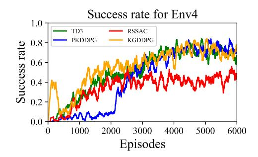

**Fig. 11.** Success rate for Env4.

<span id="page-10-0"></span>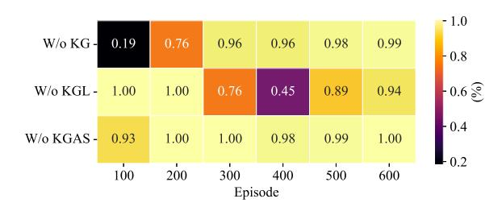

**Fig. 12.** Ablation analysis of knowledge contribution.

<span id="page-10-1"></span>**Remark 5.** The proposed method's advantage is also highly dependent on the completeness of prior knowledge: in environments with complete prior knowledge (e.g., Env1), the method outperforms TD3, while in more complex environments with less complete knowledge, the advantage is less pronounced. Thus, the method's performance improves with more complete prior knowledge.

#### *5.1.5. Ablation analysis of knowledge contribution*

To analyze the contribution of the knowledge components in our method, we conducted ablation studies. During training, we separately removed the Knowledge-Guided Action Selection strategy (KGAS), Knowledge-Guided Learning (KGL), and overall Knowledge Guidance (KG). The success rate of each ablation candidate relative to the proposed method was recorded every 100 episodes, as shown in [Fig.](#page-10-1) [12](#page-10-1). The results indicate that removing KG leads to a significant 80% decrease in success rate during the early exploration phase. This is because the absence of knowledge guidance causes random exploration to result in frequent collisions, severely hindering training efficiency. KGL plays a pivotal role in parameter learning, as its removal leads to knowledge forgetting in the mid-to-late training stages, resulting in a 24% drop in success rate. In contrast, removing KGAS shows only a slight 7% reduction in success rate during the initial phase. This minor impact is because, although KGAS is removed during interaction, its effects are partially retained through KGL. The results of KGL and KG also indirectly highlight the significant role of KGAS during the early exploration phase. In summary, the ablation study clearly demonstrates that each knowledge component contributes to the learning capability of KGDDPG. These components work collaboratively at different stages of training, ensuring the overall efficiency and robustness of the proposed method.

# *5.2. Simulation test result*

To test the trained models, 100 diverse target points different from the training scenarios were generated. In the three aforementioned environments, the models with the best performance, as indicated by the average reward curve during training, were selected for testing. The results are as follows.

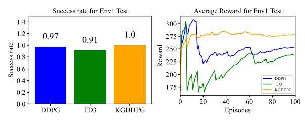

**Fig. 13.** Env1 test.

<span id="page-10-2"></span>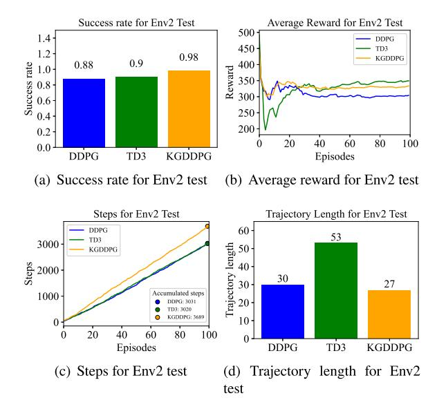

**Fig. 14.** Env2 test.

# <span id="page-10-3"></span>*5.2.1. Env1*

The success rate in this environment reveals that all three methods perform well. Comparatively, the proposed method slightly outperforms the others. The average reward curve indicates that the proposed method exhibits less fluctuation, suggesting that the model is more stable and performs more consistently across different target points (see [Fig.](#page-10-2) [13](#page-10-2)).

# *5.2.2. Env2*

In this environment, the test success rate of KGDDPG is higher than that of TD3 and DDPG, with a significant improvement compared to DDPG. Although KGDDPG has a high success rate, its average reward is lower than that of TD3. From the trajectory length, it can be seen that the total trajectory length of TD3 is the longest at 53 m, while that of KGDDPG is the shortest at 27 m, indicating that TD3 adopts a strategy of moving away first and then approaching the target point, thereby obtaining more rewards. Additionally, the total trajectory length indirectly reflects that KGDDPG has the highest path efficiency. From the step curve, it can be seen that the total number of steps for KGDDPG is 3689, while that for TD3 is 3020. Combined with the difference in trajectory length, it can be inferred that TD3 outputs a larger speed command and consumes more. In summary, the proposed method's action strategy demonstrates excellent performance in terms of success rate, path efficiency, and reward acquisition (see [Fig.](#page-10-3) [14\)](#page-10-3).

# *5.2.3. Env3*

The test results of Env3 are shown in [Fig.](#page-11-0) [15](#page-11-0). Due to the increased complexity of this environment compared to Env2, DDPG did not converge. Both KGDDPG and TD3 achieved good success rates, with KGDDPG having a higher success rate. The average reward curve of

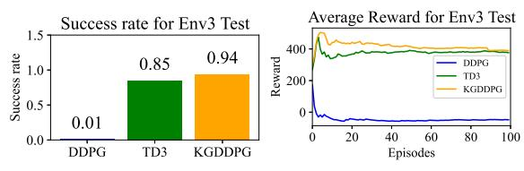

**Fig. 15.** Env3 test.

<span id="page-11-0"></span>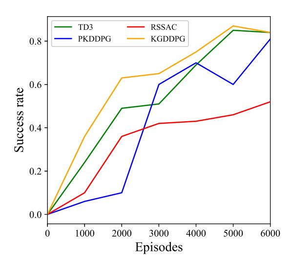

**Fig. 16.** Success rate for Env4 test.

<span id="page-11-2"></span><span id="page-11-1"></span>**Table 6** Target for experiment 1.

| Axes | Target |     |     |      |     |
|------|--------|-----|-----|------|-----|
| x    | 0.6    | 1.2 | 1.8 | 1.2  | 0.6 |
| y    | 0.6    | 0.6 | 0.0 | −0.6 | 0.0 |

KGDDPG is also higher than that of TD3, indicating that the proposed method's model has better performance.

# *5.2.4. Env4*

To further highlight the advantage of our method over TD3, we conducted additional simulations by extracting models from different training episodes and testing them multiple times in the simulation environment, as shown in [Fig.](#page-4-4) [2.](#page-4-4) From the results, we observed that the success rate of the proposed method increases significantly over training episodes, exceeding 60% within 3000 episodes. In contrast, TD3's success rate consistently remains lower than that of KGDDPG within the same number of training episodes. This demonstrates that KGDDPG achieves higher learning efficiency compared to TD3, which is one of the key objectives of our design (see [Fig.](#page-11-1) [16\)](#page-11-1).

#### *5.3. Experimental result*

To verify the feasibility of the proposed method in practical tasks, experiments were conducted in three different scenarios, with three sets of repeated experiments for each scenario. The results are as follows.

#### *5.3.1. Experiment 1*

This experiment was conducted in an obstacle-free area, which different from the simulated training environment. The entire area measures 2.4 by 1.8 m, and there are no enclosing walls around it. As shown in [Fig.](#page-6-5) [4\(a\)](#page-6-5), the selected target points are listed in [Table](#page-11-2) [6.](#page-11-2)

[Fig.](#page-11-3) [17](#page-11-3) shows the trajectory residual images of three methods in one experiment. [Fig.](#page-12-0) [18\(a\)](#page-12-0) shows the success rate of the three methods

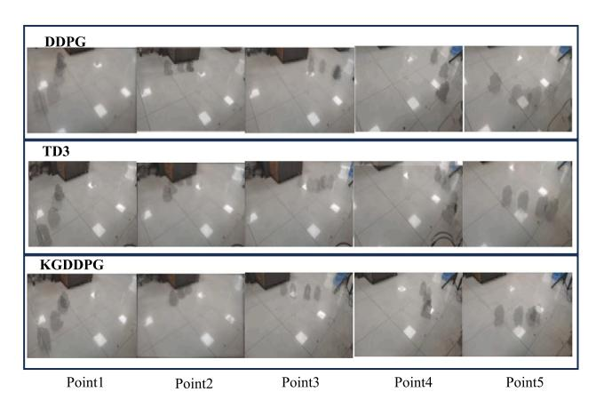

**Fig. 17.** Trajectory residual image for experiment 1.

<span id="page-11-4"></span><span id="page-11-3"></span>**Table 7** Target for experiment 2.

| Axes | Target |     |      |     |      |
|------|--------|-----|------|-----|------|
| x    | 0.8    | 1.8 | 1.1  | 0.7 | 0.0  |
| y    | 0.7    | 0.2 | −0.7 | 0.1 | −0.3 |

in each experiment conducted in this scenario. The results indicate that all three methods successfully completed the three tests. However, the completion details and specific performances varied significantly. [Fig.](#page-12-1) [18\(b\)](#page-12-1) illustrates the trajectories of DDPG in the three experiments, with the third trajectory showing a noticeable curve between the 4th and 5th target points. [Fig.](#page-12-1) [18\(c\)](#page-12-1) displays the trajectories of TD3, revealing that TD3's strategy tends to follow smoother paths between target points. In contrast, the KGDDPG strategy tends to favor the shortest path between two points, which closely mirroring with the behavior of the knowledge system. This can be attributed to the completeness of the knowledge during the Env1 training, allowing the policy network to effectively replicate the characteristics of the knowledge-based strategy through supervised learning. To quantitatively evaluate the performance of the three methods, path efficiency was calculated, as shown in [Fig.](#page-12-1) [18\(e\)](#page-12-1). The figure demonstrates that KGDDPG achieves the highest path efficiency, confirming its superior performance in Experiment 1. The higher path efficiency is also a result of the knowledge-based strategy, as the knowledge in Env1 favors the shortest path.

#### *5.3.2. Experiment 2*

In this experimental scenario, four cylindrical obstacles were added to the experimental area, as shown in [Fig.](#page-6-6) [4\(b\)](#page-6-6). This scenario simulates the training environment but differs significantly in terms of the size of the area and the positions and sizes of the obstacles. Consequently, the returned lidar data also differ greatly from the training environment. The selected target points are listed in [Table](#page-11-4) [7.](#page-11-4)

In this scenario, the trajectory residual images of three methods in one experiment are shown in [Fig.](#page-12-2) [19.](#page-12-2) The success rates of the three methods are shown in [Fig.](#page-12-3) [20\(a\).](#page-12-3) The KGDDPG strategy successfully completed the experiments, whereas the average success rate for DDPG was 0.4, and for TD3, it was only 0.27. This indicates that the KGDDPG strategy has better generalization performance and stronger adaptability to scenarios different from the training environment. [Fig.](#page-12-4) [20\(b\)](#page-12-4) shows the trajectories of DDPG in the three experiments: in the first experiment, only the third target point was reached; in the second experiment, only the 2nd and 5th target points were reached; and in the third experiment, the 2nd, 4th, and 5th target points were reached. [Fig.](#page-12-4) [20\(c\)](#page-12-4) shows the experimental trajectory of TD3. Among the three experiments of TD3, only the first target point was reached in the first experiment; only the 2nd target point was reached in the second experiment; and the 1st and 5th target points were reached in the third

<span id="page-12-0"></span>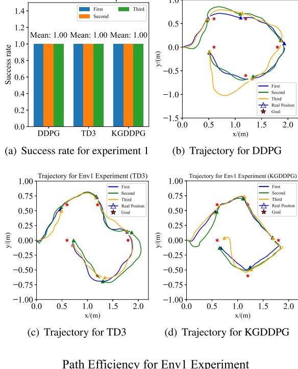

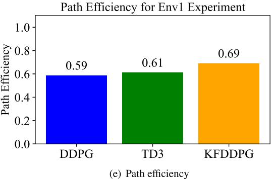

**Fig. 18.** experiment 1.

experiment. Since DDPG and TD3 did not complete the tasks, path efficiency could not be calculated for them. Therefore, only the path efficiency of KGDDPG was calculated, which was 0.65. In summary, the KGDDPG strategy demonstrates better performance.

The higher success rate of KGDDPG can be attributed to the guidance provided by the knowledge system during training, which enhanced learning efficiency, allowing the model to learn faster and achieve greater stability within the same training time. In contrast, the poor performance of DDPG and TD3 reflects their models' sensitivity to state distribution. Although the experimental environment shares similarities with the training environment, differences in the size, distance, and arrangement of obstacles, as well as the presence of other objects, resulted in significant variations in the state distribution, which negatively affected the performance of DDPG and TD3.

# *5.3.3. Experiment 3*

This experiment did not deliberately set up a specific scenario but instead tested the performance of different methods in an environment completely different from the training environment, as shown in [Fig.](#page-6-6) [4\(c\).](#page-6-6) We used the best models obtained from the training environment in Env3 for the experiments. The selected target points are listed in [Table](#page-12-5) [8](#page-12-5).

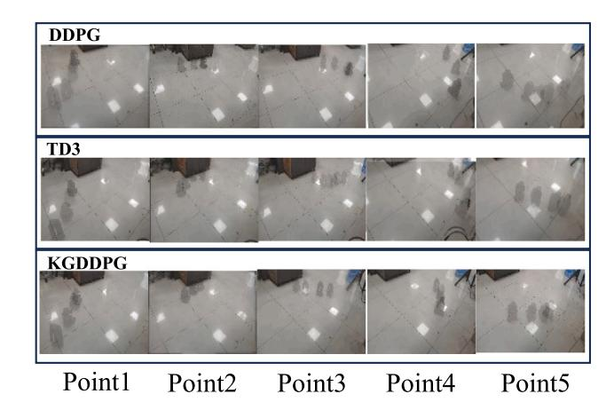

**Fig. 19.** Trajectory residual image for experiment 2.

<span id="page-12-3"></span><span id="page-12-2"></span>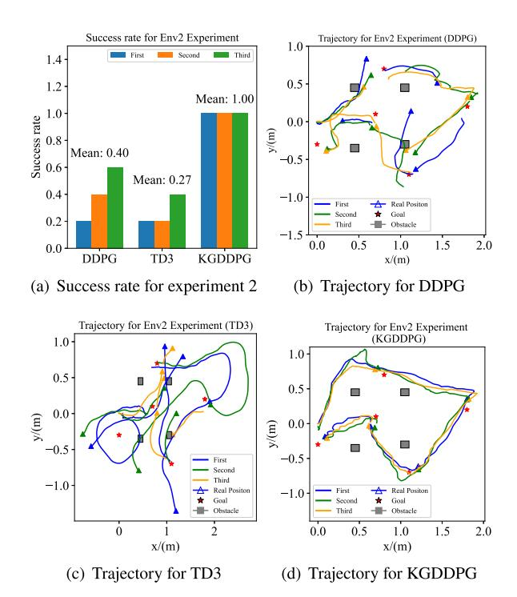

<span id="page-12-4"></span>**Fig. 20.** Experiment 2.

<span id="page-12-5"></span><span id="page-12-1"></span>**Table 8** Target for experiment 3.

| Axes | Target |     |     |     |     |  |
|------|--------|-----|-----|-----|-----|--|
| x    | 0.1    | 1.0 | 2.2 | 4.0 | 5.0 |  |
| y    | 1.0    | 0.2 | 1.0 | 0.5 | 1.2 |  |

Since DDPG did not converge in Env3 and failed to complete this experiment, it is not included for reference. Therefore, this experiment only presents the data for TD3 and KGDDPG. The success rates are shown in [Fig.](#page-13-0) [21\(a\)](#page-13-0), where the KGDDPG strategy successfully completed all three experiments. In contrast, the average success rate for TD3 was 0.6. This indicates that the KGDDPG strategy has better generalization performance and stronger adaptability to unknown scenarios. [Fig.](#page-13-1) [21\(b\)](#page-13-1) shows the trajectories of TD3 in the three experiments: in the first experiment, only the 4th target point failed; in the second experiment, only the 2nd and 4th target points failed; and in the third experiment, the 3rd, 4th, and 5th target points all failed. In the three experiments with KGDDPG, all target points were successfully

<span id="page-13-0"></span>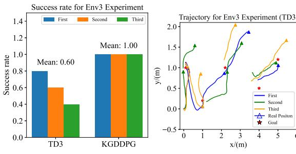

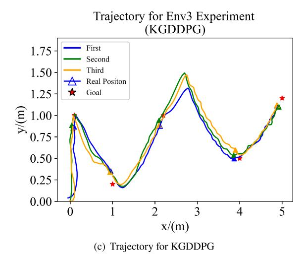

**Fig. 21.** Experiment 3.

completed, but there was a significant trajectory deviation between the 3rd and 4th target points. Since TD3 did not complete all the tasks, path efficiency could not be calculated for it. Therefore, only the path efficiency of KGDDPG was calculated, which was 0.54. The experiment was conducted in an open environment with no significant obstacles along the path. Although KGDDPG was not specifically trained in such an environment, it successfully completed all the experiments, which can be attributed to its better robustness in handling this type of target points. On the other hand, the performance of TD3 was limited, indicating that it faced challenges in adapting to unfamiliar aspects of the environment. Additionally, KGDDPG exhibited some trajectory deviation between the third and fourth target points, but the overall trend remained stable. This deviation can be attributed to sensor noise. In summary, compared to TD3, the results highlight KGDDPG's superior adaptability and robustness in navigating novel environments.

The experimental results of the three scenarios are summarized in [Table](#page-13-2) [9.](#page-13-2) Where represents no data or value that cannot be calculated. From the perspectives of task success rate and path efficiency, the proposed method's strategy performed excellently in all three experimental scenarios, demonstrating better results compared to other methods. The experimental results validate the effectiveness and feasibility of the KGDDPG method.

#### *5.3.4. Experiment 4*

To further evaluate the real-world performance of different methods, an additional experiment was conducted in a more realistic environment featuring a greater number of obstacles. The experimental environment setup is illustrated in [Fig.](#page-6-6) [4\(d\)](#page-6-6), where we selected five target points for testing, as shown in [Table](#page-13-3) [10](#page-13-3). The real-world trajectories corresponding to these targets are presented in [Fig.](#page-13-4) [22,](#page-13-4) and the complete recorded trajectories for all methods are depicted in [Fig.](#page-14-1) [23.](#page-14-1)

<span id="page-13-2"></span>**Table 9** Summary of experimental data.

| Algorithm | Experimental<br>scenario | Single<br>success rate | Average<br>success rate | Path<br>efficiency |
|-----------|--------------------------|------------------------|-------------------------|--------------------|
| DDPG      | 1                        | 1.0/1.0/1.0            | 1.0                     | 0.59               |
|           | 2                        | 0.2/0.4/0.6            | 0.4                     | 𝑋                  |
|           | 3                        | 𝑋/𝑋/𝑋                  | 𝑋                       | 𝑋                  |
| TD3       | 1                        | 1.0/1.0/1.0            | 1.0                     | 0.61               |
|           | 2                        | 0.2/0.2/0.4            | 0.27                    | 𝑋                  |
|           | 3                        | 0.8/0.6/0.4            | 0.6                     | 𝑋                  |
| KGDDPG    | 1                        | 1.0/1.0/1.0            | 1.0                     | 0.69               |
|           | 2                        | 1.0/1.0/1.0            | 1.0                     | 0.65               |
|           | 3                        | 1.0/1.0/1.0            | 1.0                     | 0.54               |

<span id="page-13-3"></span>**Table 10** Target for experiment 4.

| Axes | Target |     |     |      |      |
|------|--------|-----|-----|------|------|
| x    | 0.8    | 1.1 | 2.2 | 2.7  | 1.5  |
| y    | 0.7    | 0.3 | 1.2 | −0.5 | −0.6 |

<span id="page-13-1"></span>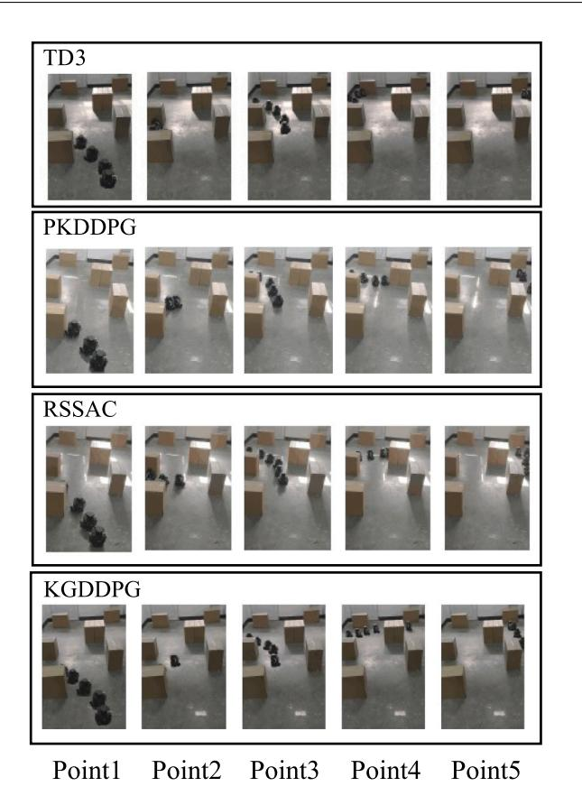

**Fig. 22.** Trajectory residual image for experiment 4.

<span id="page-13-4"></span>From [Fig.](#page-14-1) [23,](#page-14-1) it can be observed that the TD3 method successfully reached the first and third target points, but issues with the remaining points occurred primarily during the turning phases, often due to large turning radii resulting in collisions. This can be attributed to limited generalization, as the actual environment is smaller and more densely populated with obstacles compared to the training environment, making the turning behavior learned in training unsuitable for direct application in the real environment. The PKDDPG method reached the second, third, and fifth target points. However, for the first point, the direction was correct but the robot did not maintain the appropriate distance from obstacles. At the fourth point, after changing direction, the robot did not immediately turn toward the target but instead moved toward the lower-right area, only redirecting toward

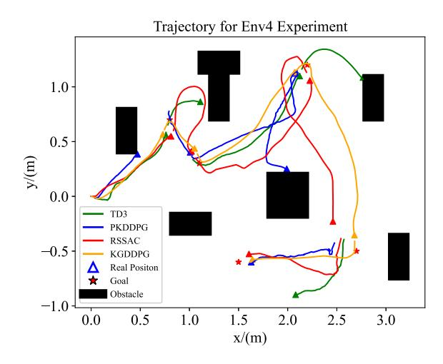

**Fig. 23.** Trajectory for experiment 4.

<span id="page-14-1"></span>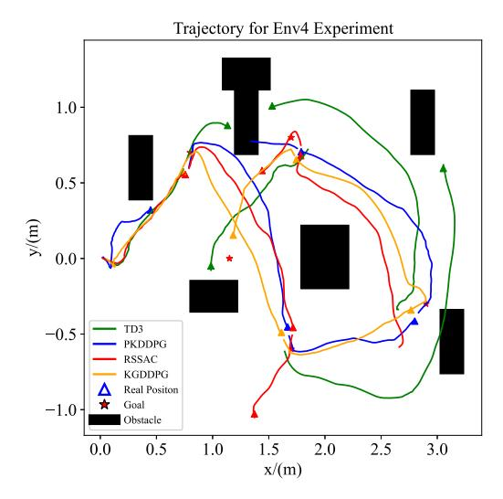

**Fig. 24.** Trajectory for experiment 4 (1).

<span id="page-14-2"></span>the target once a significant angle was formed. This is due to the insufficient influence of the angular deviation in the state on the action output. While RSSAC successfully completed all target points, it showed significant trajectory curvature at the second, fourth, and fifth points, which could be a result of the model's turning function converging to a local optimum. In contrast, KGDDPG clearly outperformed the other methods, demonstrating stable performance in both turning and traveling. This can be attributed to the enhanced learning efficiency under knowledge guidance and the fact that supervised learning helped the policy network maintain key characteristics of the knowledge-based strategy during autonomous interactions.

To mitigate the uncertainty in real-world experiments, we conducted additional navigation experiments with more target points (as shown in [Fig.](#page-14-2) [24](#page-14-2)), and the results were consistent with previous realworld tests, confirming the reliability of the findings. Compared to the simulation results, TD3 performed well during training but underperformed in the real-world environment. Upon analysis, we found that TD3's strategy was heavily influenced by the training environment and reward function, particularly by its use of large-radius turns to optimize rewards, which led to collisions with obstacles in the real world. In contrast, other methods did not exhibit this behavior, with KGDDPG demonstrating better generalization to the real-world environment. This supports the conclusion that KGDDPG's final policy behavior is influenced by both the reward function and prior knowledge, highlighting the unique characteristics of the proposed method.

These results demonstrate that the proposed KGDDPG method consistently outperforms other approaches in terms of overall performance, particularly in environments with increased complexity. While RSSAC achieved a similar success rate, its less efficient trajectories highlight the advantages of KGDDPG in balancing success rate and path efficiency. This further validates the practical effectiveness of the proposed method under more complex real-world conditions, reinforcing its applicability in challenging scenarios.

#### **6. Conclusion**

<span id="page-14-0"></span>This paper explores how to utilize knowledge to guide the learning of agents, thereby enhancing their learning efficiency and performance. It primarily addresses key issues such as the representation of knowledge with both fuzzy and precise meanings and the integration of knowledge into the existing DDPG framework. A pre-supervised and then reinforced learning method with a multi-source action fusion strategy is proposed. Compared to the noise-introducing random exploration mechanism, the knowledge-integrated action strategy can reduce exploration randomness to a certain extent. Additionally, the pre-supervised and then reinforced learning method leverages existing knowledge while avoiding the limitations of introducing knowledge. Finally, extensive simulations and experiments on the mapless navigation task of mobile robots validate the effectiveness and feasibility of the proposed method. However, the method also has some limitations. The knowledge system in this paper still faces significant challenges in converting high-level semantics into specific outputs, making it difficult for agents to truly understand high-level semantics. Therefore, improving the construction of knowledge rules to make the system adaptable to a wider range of multimodal knowledge has important research prospects. Future work will focus on integrating multimodal knowledge into the agent's decision-making process, inspired by recent advances in Transformer-based models. We aim to explore how different modalities, such as text, images, and logical reasoning, can be unified into a shared feature space to guide agent behavior. Our future research will investigate using pre-trained Transformer models fine-tuned for specific tasks or developing hybrid models that combine vision and language-based reasoning, laying the foundation for more adaptable reinforcement learning systems capable of tackling a wide range of tasks and environments.

#### **CRediT authorship contribution statement**

**Peng Qin:** Writing – original draft, Validation, Software, Methodology, Conceptualization. **Tao Zhao:** Resources, Project administration, Investigation, Funding acquisition, Conceptualization.

# **Declaration of competing interest**

The authors declare that they have no known competing financial interests or personal relationships that could have appeared to influence the work reported in this paper.

#### **Acknowledgments**

This work was supported in part by Sichuan Science and Technology Program under Grant 2024ZYD0029, in part by the National Natural Science Foundation of China under Grant 62473273.

#### **Data availability**

No data was used for the research described in the article.

#### **References**

- <span id="page-15-0"></span>[1] Q. Zou, Q. Sun, L. Chen, B. Nie, Q. Li, A [comparative](http://refhub.elsevier.com/S0950-7051(25)00134-0/sb1) analysis of LiDAR SLAMbased indoor navigation for [autonomous](http://refhub.elsevier.com/S0950-7051(25)00134-0/sb1) vehicles, IEEE Trans. Intell. Transp. Syst. 23 (7) (2022) [6907–6921.](http://refhub.elsevier.com/S0950-7051(25)00134-0/sb1)
- [2] X. Liu, G.V. Nardari, F. Cladera, Y. Tao, A. Zhou, T. [Donnelly,](http://refhub.elsevier.com/S0950-7051(25)00134-0/sb2) C. Qu, S.W. Chen, R.A.F. Romero, C.J. Taylor, V. Kumar, Large-scale [autonomous](http://refhub.elsevier.com/S0950-7051(25)00134-0/sb2) flight with real-time [semantic](http://refhub.elsevier.com/S0950-7051(25)00134-0/sb2) SLAM under dense forest canopy, IEEE Robot. Autom. Lett. 7 (2) (2022) [5512–5519.](http://refhub.elsevier.com/S0950-7051(25)00134-0/sb2)
- <span id="page-15-1"></span>[3] L. Xia, D. Meng, J. Zhang, D. Zhang, Z. Hu, [Visual-inertial](http://refhub.elsevier.com/S0950-7051(25)00134-0/sb3) simultaneous localization and mapping: [Dynamically](http://refhub.elsevier.com/S0950-7051(25)00134-0/sb3) fused point-line feature extraction and engineered robotic [applications,](http://refhub.elsevier.com/S0950-7051(25)00134-0/sb3) IEEE Trans. Instrum. Meas. 71 (2022) 1–11.
- <span id="page-15-2"></span>[4] Y. Jang, J. Baek, S. Han, Hindsight [intermediate](http://refhub.elsevier.com/S0950-7051(25)00134-0/sb4) targets for mapless navigation with deep [reinforcement](http://refhub.elsevier.com/S0950-7051(25)00134-0/sb4) learning, IEEE Trans. Ind. Electron. 69 (11) (2022) [11816–11825.](http://refhub.elsevier.com/S0950-7051(25)00134-0/sb4)
- [5] E. Marchesini, A. Farinelli, Discrete deep [reinforcement](http://refhub.elsevier.com/S0950-7051(25)00134-0/sb5) learning for mapless navigation, in: 2020 IEEE [International](http://refhub.elsevier.com/S0950-7051(25)00134-0/sb5) Conference on Robotics and Automation, ICRA, 2020, pp. [10688–10694.](http://refhub.elsevier.com/S0950-7051(25)00134-0/sb5)
- <span id="page-15-3"></span>[6] W. Zhang, Y. Zhang, N. Liu, K. Ren, P. Wang, IPAPRec: A [promising](http://refhub.elsevier.com/S0950-7051(25)00134-0/sb6) tool for learning [high-performance](http://refhub.elsevier.com/S0950-7051(25)00134-0/sb6) mapless navigation skills with deep reinforcement learning, IEEE/ASME Trans. [Mechatronics](http://refhub.elsevier.com/S0950-7051(25)00134-0/sb6) 27 (6) (2022) 5451–5461.
- <span id="page-15-4"></span>[7] M. Gheisarnejad, M.H. Khooban, An intelligent non-integer PID [controller-based](http://refhub.elsevier.com/S0950-7051(25)00134-0/sb7) deep reinforcement learning: [Implementation](http://refhub.elsevier.com/S0950-7051(25)00134-0/sb7) and experimental results, IEEE Trans. Ind. Electron. 68 (4) (2021) [3609–3618.](http://refhub.elsevier.com/S0950-7051(25)00134-0/sb7)
- <span id="page-15-5"></span>[8] Y.-C. Liu, C.-Y. Huang, [DDPG-based](http://refhub.elsevier.com/S0950-7051(25)00134-0/sb8) adaptive robust tracking control for aerial [manipulators](http://refhub.elsevier.com/S0950-7051(25)00134-0/sb8) with decoupling approach, IEEE Trans. Cybern. 52 (8) (2022) [8258–8271.](http://refhub.elsevier.com/S0950-7051(25)00134-0/sb8)
- <span id="page-15-6"></span>[9] L. Xie, Y. Miao, S. Wang, P. Blunsom, Z. Wang, C. Chen, A. [Markham,](http://refhub.elsevier.com/S0950-7051(25)00134-0/sb9) N. Trigoni, Learning with stochastic guidance for robot [navigation,](http://refhub.elsevier.com/S0950-7051(25)00134-0/sb9) IEEE Trans. Neural Netw. Learn. Syst. 32 (1) (2021) [166–176.](http://refhub.elsevier.com/S0950-7051(25)00134-0/sb9)
- <span id="page-15-7"></span>[10] B. Li, Z. Huang, T.W. Chen, T. Dai, Y. Zang, W. Xie, B. Tian, K. Cai, MSN: [Mapless](http://refhub.elsevier.com/S0950-7051(25)00134-0/sb10) short-range navigation based on time critical deep [reinforcement](http://refhub.elsevier.com/S0950-7051(25)00134-0/sb10) learning, IEEE Trans. Intell. Transp. Syst. 24 (8) (2023) [8628–8637.](http://refhub.elsevier.com/S0950-7051(25)00134-0/sb10)
- <span id="page-15-8"></span>[11] M. Liu, F. Zhao, J. Yin, J. Niu, Y. Liu, [Reinforcement-tracking:](http://refhub.elsevier.com/S0950-7051(25)00134-0/sb11) An effective trajectory tracking and navigation method for [autonomous](http://refhub.elsevier.com/S0950-7051(25)00134-0/sb11) urban driving, IEEE Trans. Intell. Transp. Syst. 23 (7) (2022) [6991–7007.](http://refhub.elsevier.com/S0950-7051(25)00134-0/sb11)
- <span id="page-15-9"></span>[12] T. Liu, L. Lei, K. Zheng, K. Zhang, [Autonomous](http://refhub.elsevier.com/S0950-7051(25)00134-0/sb12) platoon control with integrated deep reinforcement learning and dynamic [programming,](http://refhub.elsevier.com/S0950-7051(25)00134-0/sb12) IEEE Internet Things J. 10 (6) (2023) [5476–5489.](http://refhub.elsevier.com/S0950-7051(25)00134-0/sb12)
- <span id="page-15-10"></span>[13] Y. Tian, X. Cao, K. Huang, C. Fei, Z. Zheng, X. Ji, [Learning](http://refhub.elsevier.com/S0950-7051(25)00134-0/sb13) to drive like human beings: A method based on deep [reinforcement](http://refhub.elsevier.com/S0950-7051(25)00134-0/sb13) learning, IEEE Trans. Intell. Transp. Syst. 23 (7) (2022) [6357–6367.](http://refhub.elsevier.com/S0950-7051(25)00134-0/sb13)
- <span id="page-15-11"></span>[14] S. Zhou, X. Dai, H. Chen, W. Zhang, K. Ren, R. Tang, X. He, Y. Yu, [Interactive](http://refhub.elsevier.com/S0950-7051(25)00134-0/sb14) recommender system via knowledge [graph-enhanced](http://refhub.elsevier.com/S0950-7051(25)00134-0/sb14) reinforcement learning, in: Proceedings of the 43rd [International](http://refhub.elsevier.com/S0950-7051(25)00134-0/sb14) ACM SIGIR Conference on Research and [Development](http://refhub.elsevier.com/S0950-7051(25)00134-0/sb14) in Information Retrieval, SIGIR '20, Association for Computing [Machinery,](http://refhub.elsevier.com/S0950-7051(25)00134-0/sb14) New York, NY, USA, 2020, pp. 179–188.

- <span id="page-15-12"></span>[15] H. Cui, T. Peng, R. Han, J. Han, L. Liu, [Path-based](http://refhub.elsevier.com/S0950-7051(25)00134-0/sb15) multi-hop reasoning over knowledge graph for answering questions via adversarial [reinforcement](http://refhub.elsevier.com/S0950-7051(25)00134-0/sb15) learning, [Knowl.-Based](http://refhub.elsevier.com/S0950-7051(25)00134-0/sb15) Syst. 276 (2023) 110760.
- <span id="page-15-13"></span>[16] L. Illanes, X. Yan, R.T. Icarte, S.A. McIlraith, Symbolic plans as [high-level](http://refhub.elsevier.com/S0950-7051(25)00134-0/sb16) instructions for [reinforcement](http://refhub.elsevier.com/S0950-7051(25)00134-0/sb16) learning, in: Proceedings of the International Conference on Automated Planning and [Scheduling,](http://refhub.elsevier.com/S0950-7051(25)00134-0/sb16) Vol. 30, 2020, pp. 540–550.
- <span id="page-15-14"></span>[17] L. Guan, S. Sreedharan, S. [Kambhampati,](http://refhub.elsevier.com/S0950-7051(25)00134-0/sb17) Leveraging approximate symbolic models for [reinforcement](http://refhub.elsevier.com/S0950-7051(25)00134-0/sb17) learning via skill diversity, in: International Conference on Machine Learning, PMLR, 2022, pp. [7949–7967.](http://refhub.elsevier.com/S0950-7051(25)00134-0/sb17)
- <span id="page-15-15"></span>[18] Z. Mei, T. Zhao, X. Xie, [Hierarchical](http://refhub.elsevier.com/S0950-7051(25)00134-0/sb18) fuzzy regression tree: A new gradient boosting [approach](http://refhub.elsevier.com/S0950-7051(25)00134-0/sb18) to design a TSK fuzzy model, Inform. Sci. 652 (2024) 119740.
- <span id="page-15-16"></span>[19] Z. Mei, T. Zhao, X. Gu, A dynamic evolving fuzzy system for [streaming](http://refhub.elsevier.com/S0950-7051(25)00134-0/sb19) data prediction, IEEE Trans. Fuzzy Syst. 32 (8) (2024) [4324–4337.](http://refhub.elsevier.com/S0950-7051(25)00134-0/sb19)
- <span id="page-15-17"></span>[20] T. Zhao, P. Qin, S. Dian, B. Guo, [Fractional](http://refhub.elsevier.com/S0950-7051(25)00134-0/sb20) order sliding mode control for an [omni-directional](http://refhub.elsevier.com/S0950-7051(25)00134-0/sb20) mobile robot based on self-organizing interval type-2 fuzzy neural [network,](http://refhub.elsevier.com/S0950-7051(25)00134-0/sb20) Inform. Sci. 654 (2024) 119819.
- [21] S. Tian, T. Zhao, [Self-organizing](http://refhub.elsevier.com/S0950-7051(25)00134-0/sb21) interval type-2 function-link fuzzy neural network control for uncertain manipulators under saturation: A [predefined-time](http://refhub.elsevier.com/S0950-7051(25)00134-0/sb21) [sliding-mode](http://refhub.elsevier.com/S0950-7051(25)00134-0/sb21) approach, Appl. Soft Comput. 165 (2024).
- <span id="page-15-18"></span>[22] X. You, S. Dian, K. Liu, B. Guo, G. Xiang, Y. Zhu, Command [filter-based](http://refhub.elsevier.com/S0950-7051(25)00134-0/sb22) adaptive fuzzy finite-time tracking control for uncertain [fractional-order](http://refhub.elsevier.com/S0950-7051(25)00134-0/sb22) nonlinear systems, IEEE Trans. Fuzzy Syst. 31 (1) (2023) [226–240.](http://refhub.elsevier.com/S0950-7051(25)00134-0/sb22)
- <span id="page-15-19"></span>[23] P. Ladosz, L. Weng, M. Kim, H. Oh, Exploration in deep [reinforcement](http://refhub.elsevier.com/S0950-7051(25)00134-0/sb23) learning: A [survey,](http://refhub.elsevier.com/S0950-7051(25)00134-0/sb23) Inf. Fusion 85 (2022) 1–22.
- <span id="page-15-20"></span>[24] X. Li, X. Wang, X. Zheng, J. Jin, Y. Huang, J.J. Zhang, F.-Y. Wang, [SADRL:](http://refhub.elsevier.com/S0950-7051(25)00134-0/sb24) Merging human experience with machine [intelligence](http://refhub.elsevier.com/S0950-7051(25)00134-0/sb24) via supervised assisted deep reinforcement learning, [Neurocomputing](http://refhub.elsevier.com/S0950-7051(25)00134-0/sb24) 467 (2022) 300–309.
- <span id="page-15-21"></span>[25] Z. Hu, Y. Zheng, J. Pan, Grasping living objects with [adversarial](http://refhub.elsevier.com/S0950-7051(25)00134-0/sb25) behaviors using inverse [reinforcement](http://refhub.elsevier.com/S0950-7051(25)00134-0/sb25) learning, IEEE Trans. Robot. 39 (2) (2023) 1151–1163.
- <span id="page-15-22"></span>[26] F. Zhao, Q. Wang, L. Wang, An inverse [reinforcement](http://refhub.elsevier.com/S0950-7051(25)00134-0/sb26) learning framework with the Q-learning mechanism for the [metaheuristic](http://refhub.elsevier.com/S0950-7051(25)00134-0/sb26) algorithm, Knowl.-Based Syst. 265 (2023) [110368.](http://refhub.elsevier.com/S0950-7051(25)00134-0/sb26)
- <span id="page-15-23"></span>[27] J. Peng, Y. Fan, G. Yin, R. Jiang, [Collaborative](http://refhub.elsevier.com/S0950-7051(25)00134-0/sb27) optimization of energy management strategy and adaptive cruise control based on deep [reinforcement](http://refhub.elsevier.com/S0950-7051(25)00134-0/sb27) learning, IEEE Trans. Transp. [Electrification](http://refhub.elsevier.com/S0950-7051(25)00134-0/sb27) 9 (1) (2023) 34–44.
- <span id="page-15-24"></span>[28] Z. Mao, M. Xia, B. Jiang, D. Xu, P. Shi, Incipient fault diagnosis for [high-speed](http://refhub.elsevier.com/S0950-7051(25)00134-0/sb28) train traction systems via stacked [generalization,](http://refhub.elsevier.com/S0950-7051(25)00134-0/sb28) IEEE Trans. Cybern. 52 (8) (2022) [7624–7633.](http://refhub.elsevier.com/S0950-7051(25)00134-0/sb28)
- <span id="page-15-25"></span>[29] B. Qin, Y. Nojima, H. Ishibuchi, S. Wang, Realizing deep [high-order](http://refhub.elsevier.com/S0950-7051(25)00134-0/sb29) TSK fuzzy classifier by ensembling interpretable zero-order TSK fuzzy [subclassifiers,](http://refhub.elsevier.com/S0950-7051(25)00134-0/sb29) IEEE Trans. Fuzzy Syst. 29 (11) (2021) [3441–3455.](http://refhub.elsevier.com/S0950-7051(25)00134-0/sb29)
- <span id="page-15-26"></span>[30] P. Lou, K. Xu, X. Jiang, Z. Xiao, J. Yan, Path planning in an [unknown](http://refhub.elsevier.com/S0950-7051(25)00134-0/sb30) environment based on deep [reinforcement](http://refhub.elsevier.com/S0950-7051(25)00134-0/sb30) learning with prior knowledge, J. Intell. Fuzzy Syst. 41 (6) (2021) [5773–5789.](http://refhub.elsevier.com/S0950-7051(25)00134-0/sb30)
- <span id="page-15-27"></span>[31] V.R.F. Miranda, A.A. Neto, G.M. Freitas, L.A. Mozelli, [Generalization](http://refhub.elsevier.com/S0950-7051(25)00134-0/sb31) in deep [reinforcement](http://refhub.elsevier.com/S0950-7051(25)00134-0/sb31) learning for robotic navigation by reward shaping, IEEE Trans. Ind. Electron. 71 (6) (2024) [6013–6020.](http://refhub.elsevier.com/S0950-7051(25)00134-0/sb31)